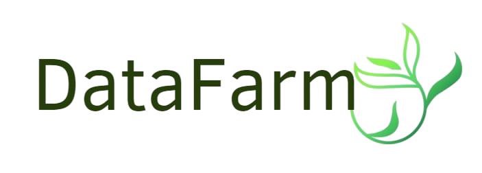

# Data Farm - Smart & Sustainable Agriculture Platform with AI & ODD

<div align="center">
  
  <p><em>Revolutionizing agriculture with AI and sustainable practices</em></p>
</div>
## 📋 Overview

**Data Farm** is an intelligent desktop application developed as part of the **Esprit School of Engineering** university project.

The platform aims to revolutionize agricultural management through modern technologies by integrating:

- ✅ **Digital farm management system**
- ✅ **Intelligent automation of crops, lands, and resources**
- ✅ **Artificial Intelligence (YOLOv8) for plant disease and weed detection**
- ✅ **Sustainable Development Goals (SDG) tracking and implementation**

## 🌱 Sustainable Development Goals (SDG)

Data Farm actively contributes to the UN's Sustainable Development Goals:

### 🔋 **Goal 7: Affordable and Clean Energy**
- Promotion of renewable energy from recycled agricultural waste (biogas)

### ♻️ **Goal 12: Responsible Consumption and Production**
- Sustainable management of agricultural resources
- Resource optimization and waste reduction
- Efficient agricultural waste management with intelligent recycling processes

### 🌍 **Goal 13: Climate Action**
- Promotion of renewable energy and circular economy solutions
- Reduction of environmental impacts through intelligent and sustainable management

## ⭐ Key Features

### User Management
- Multi-role system (Admin, Farmer, Client, Worker)
- Authentication with secure login/signup
- Password reset functionality

### Land & Crop Management
- Digital parcel creation with precise geolocation
- Real-time temperature monitoring via Weather API
- Crop selection and monitoring tailored to land specifications

### Product Management
- Agricultural product listing and e-commerce functionality
- Order processing and tracking
- Sales statistics and reporting

### Waste Management
- Agricultural waste declaration and tracking
- Intelligent recycling allocation
- Waste collection PDF reports

### Equipment Management
- Equipment listing and availability tracking
- Reservation system for workers
- SMS notifications for reservation confirmations

### Communication
- Claim/support ticket system
- Email notifications for product sales
- QR code generation for orders

### AI-Powered Analysis
- **YOLOv8 Disease Detection**: Identifies unhealthy plants and crops
- **YOLOv8 Weed Classification**: Distinguishes between harmful and beneficial weeds

## 🛠️ Technologies

### Backend & Frontend
- **Java 17+**
- **JavaFX** for modern UI
- **Scene Builder** for UI design
- **FXML** for UI structure

### Database
- **MySQL** database
- **Hibernate ORM** for database mapping

### AI & Image Processing
- **Python 3.8+** (integrated via ProcessBuilder)
- **Ultralytics YOLOv8**
- **DJL (Deep Java Library)** for AI integration
- **OpenCV** for image processing

### APIs & Services
- **OkHttp/Retrofit** for REST API calls
- **Weather API** (geolocation and real-time temperature)
- **JavaMail API** for email notifications
- **Twilio API** for SMS services
- **ZXing** for QR code generation
- **iText** for PDF generation

### Build Tools
- **Maven**
- **Git** for version control

## 📥 Installation

### Prerequisites
- JDK 17 or higher
- MySQL 8.0+
- Python 3.8+ (for AI features)
- Maven 3.6+

### Setting up the JavaFX Application

```bash
# Clone repository
git clone https://github.com/your-username/data-farm.git
cd data-farm

# Build the project with Maven
mvn clean install

# Run the application
mvn javafx:run
```

### Database Setup

```sql
-- Create database
CREATE DATABASE datafarm_db;

-- Create user and grant privileges
CREATE USER 'datafarm_user'@'localhost' IDENTIFIED BY 'password';
GRANT ALL PRIVILEGES ON datafarm_db.* TO 'datafarm_user'@'localhost';
FLUSH PRIVILEGES;
```

### Setting up Python & YOLOv8 for AI Features

```bash
# Install Python 3.8+ from https://www.python.org/downloads/

# Create and activate virtual environment
python -m venv venv

# On Windows
venv\Scripts\activate
# On macOS/Linux
source venv/bin/activate

# Update pip
pip install --upgrade pip

# Install Ultralytics (YOLOv8)
pip install ultralytics

# Install other dependencies
pip install opencv-python numpy pillow

# Verify installation
yolo
```

## 🚀 Usage

### For Farmers
1. Create your account and set up your farm profile
2. Add and manage your land parcels with geolocation
3. Select appropriate crops based on land characteristics
4. Monitor real-time weather conditions
5. List agricultural products for sale
6. Manage equipment and waste recycling

### For Clients
1. Browse available agricultural products
2. Place orders with secure checkout
3. Track order status

### For Workers
1. View available equipment
2. Make reservations for needed tools
3. Receive SMS confirmations

### For Administrators
1. Manage user accounts and permissions
2. Handle support tickets and claims
3. Access comprehensive statistics and reports

## 🔄 Development Workflow

### Project Structure
```
data-farm/
├── src/
│   ├── main/
│   │   ├── java/
│   │   │   └── edy/connection/
│   │   │       ├── app/        # Main application
│   │   │       ├── controller/ # JavaFX controllers
│   │   │       ├── model/      # Data models
│   │   │       ├── dao/        # Data access objects
│   │   │       ├── service/    # Business logic
│   │   │       ├── util/       # Utility classes
│   │   │       └── ai/         # AI integration
│   │   ├── resources/
│   │   │   ├── fxml/           # UI layout files
│   │   │   ├── css/            # Stylesheets
│   │   │   ├── images/         # Images and icons
│   │   │   └── python/         # Python scripts for AI
│   │   └── META-INF/
│   └── test/                   # Unit tests
├── pom.xml                     # Maven configuration
└── README.md
```

### Running the Application
```bash
# Start the application with Maven
mvn javafx:run

# Run AI services separately if needed
cd src/main/resources/python
python run_detection.py
```

### Testing
```bash
# Run tests
